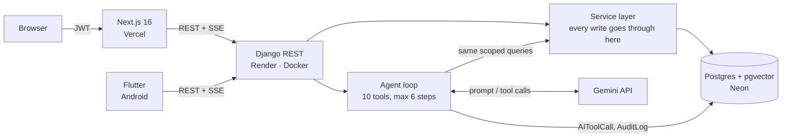
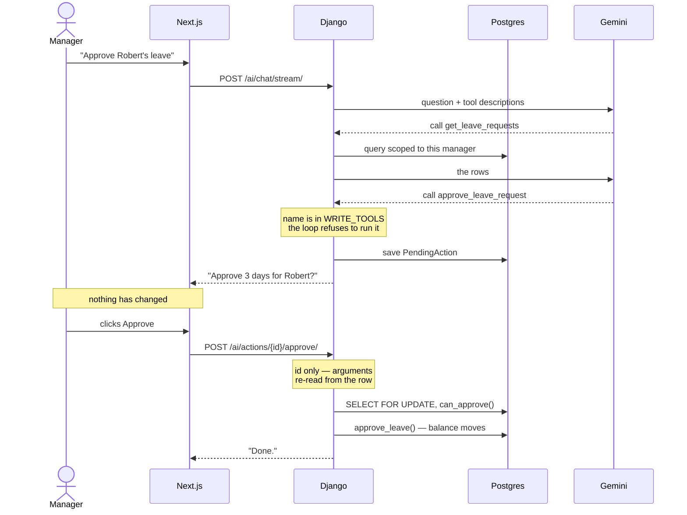

# AURA HR


An HR platform with an AI assistant that can only see what you can see.

Employees, leave, attendance and company policy — plus an agent that answers
questions about them by calling the same scoped queries the REST API uses. It
can propose changes, but it can never make one without a person clicking
approve.

A Django backend, a Next.js web app, and a Flutter mobile app, all against
the same API.



**Live demo:** https://aura-hr-rho.vercel.app
**API docs:** https://aura-hr-j0jp.onrender.com/api/docs/
**Mobile:** `mobile/` — build with `flutter build apk --release`

> The backend is on a free tier and sleeps after 15 minutes idle. The first
> request may take ~50 seconds.

## Try it

| Role | Email | Password |
|---|---|---|
| Admin | `admin@aurahr.com` | `Password@123` |
| Manager | `manager@aurahr.com` | `Password@123` |
| Employee | `aaron.nguyen@aurahr.com` | `Password@123` |

Worth trying, in this order:

1. As the **manager**, open **Assistant** and ask
   *"Show me pending leave requests"*, then *"Approve the one for Robert
   Johnson"*. You get a confirmation card. Nothing has changed yet.
2. Click **Approve**. Now it has.
3. Sign in as the **employee** and ask the same question. The agent can't
   find it — same code, same tool, different user.

That third step is the point of the project.

## The AI layer

### The agent loop

No framework. A `while` loop that asks the model, runs whatever tool it asks
for, hands back the result, and repeats until it writes an answer — bounded
at six steps.

```
question → model → wants a tool? → run it (scoped to the user) → back to the model
                 → no tool?      → that's the answer
```

Ten tools, all read-only except two. Every one takes the authenticated user
as its first argument and filters through `common/scoping.py` — the single
definition of "which employee rows may this person see".



### The approval gate

Two of the ten tools write. The loop refuses to run them:

```python
if call.name in WRITE_TOOLS:
    # don't run it — save it and ask a human
```

It writes a `PendingAction` row and tells the model it's waiting. A person
approves in a **separate HTTP request**, which re-reads the arguments from
that row — the browser only ever holds an ID, so a user can't be shown one
action and have their client submit another. Permission is re-checked at
execution time, and the row is locked with `select_for_update` so a
double-click can't approve twice.

Membership of `WRITE_TOOLS` is a set in the code. The model isn't consulted
and can't opt out, which is why prompt injection has nothing to persuade.

### RAG

Company documents are chunked, embedded with `gemini-embedding-2` (768
dimensions), and stored in Postgres with `pgvector`. Search filters
permissions **inside the SQL**:

```sql
WHERE (employee_id IS NULL OR employee_id IN (...))   -- first
ORDER BY embedding <=> :question                       -- then
LIMIT 5
```

Filtering afterwards in Python would leak: an unauthorised user would get a
*shorter* list, and the missing rows would tell them a document exists.

Retrieved passages are fenced with a random per-request token so a document
can't close the fence and issue instructions. Tested with a policy file
containing a planted injection — the agent ignored it, and couldn't have
executed the write anyway.

### Everything is logged

`AIToolCall` records every tool the agent ran, who asked, whether it was
allowed, and how long it took. Refusals are logged as carefully as
successes — they're the record of the scoping rules firing. Visible at
**AI activity** as an admin.

## The mobile app

A Flutter client for the same API, in `mobile/`.

Four screens: sign in, leave balance, apply for leave, and the assistant with
the same approval card. A manager can approve an AI-proposed leave decision
from their phone, and it goes through the identical server-side checks — the
gate lives in the agent loop, so no client can route around it.

**Shape**

Feature folders, each split into `data` (talks to HTTP), `domain` (plain
models) and `presentation` (screens). A repository throws the app's own
`Failure` types, never a `DioException`, so no screen ever sees a status code.

**Worth pointing at**

- Tokens live in the Android Keystore, not shared preferences
- A dio interceptor renews an expired token and retries once, with a
  single-flight guard so five simultaneous 401s cause one refresh, not five
- Server-sent events are parsed through a buffer, because network chunks do
  not line up with event boundaries — a bug that works locally and fails on a
  real connection
- Models are generated from the API's JSON, which caught a field the web app
  had typed wrong for weeks (`LeaveBalance.id` is an int, not a string)
- One `redirect` in go_router protects every private route, rather than each
  screen remembering to check

**Running it**

```bash
cd mobile
flutter pub get
dart run build_runner build
flutter run

# against a local backend (10.0.2.2 is how an emulator reaches your machine)
flutter run --dart-define=API_BASE_URL=http://10.0.2.2:8000/api/v1
```

## Architecture

```
Next.js (Vercel)  ─┐
                   ├─►  Django REST (Render, Docker)  ──►  Postgres + pgvector (Neon)
Flutter (Android) ─┘                │
                                    └──►  Gemini API
```

| Decision | Why |
|---|---|
| Service layer owns every write | The rules hold for the API, the admin and the agent alike |
| Querysets are the security boundary | A permission class can't protect a list endpoint |
| No repository layer | Django's ORM is already one |
| Hand-written agent loop, not LangGraph | The approval gate spans two HTTP requests; the state had to be a Django model for the audit log anyway, and a checkpointer would have been a second store of the same thing |
| Server-sent events, not websockets | One-directional, and it works through any proxy |
| Threaded gunicorn workers | A stream holds a worker for ~15 seconds; the default sync worker would block the site |

## Security

- JWT with rotation and a blacklist; unverified accounts can't sign in
- Row scoping defined once in `common/scoping.py`, used by the API,
  the dashboard and every AI tool
- Append-only `AuditLog` and `AIToolCall` — no write path through the API
- Soft deletes; nothing is destroyed
- Agent permissions derive from the JWT, never from the conversation

## Stack

**Backend** — Django 6.0, DRF 3.17, Postgres + pgvector, `google-genai`,
gunicorn, Docker
**Web** — Next.js 16, React 19, Tailwind 4, Base UI, zustand, axios
**Mobile** — Flutter 3.47, Riverpod, dio, freezed, go_router
**Infra** — Render, Vercel, Neon, GitHub Actions

~7,600 lines of Python, ~6,600 of TypeScript and ~2,400 of Dart, across 98
API endpoints.

## Tests

78 tests, running in CI on every push.

| | What they cover |
|---|---|
| **Backend** (63) | Row scoping across all four roles, every AI tool's access control, the approval gate, and the leave balance arithmetic |
| **Mobile** (15) | Error mapping, the auth repository including logout with no network, and widget tests for the login screen |

```bash
cd backend && pytest
cd mobile && flutter test
```

Most of them assert that something did **not** happen — that a manager cannot
see another team, that proposing a write changes nothing. That shape of test
is what catches security bugs; the one where `if` should have been `elif` was
invisible to every test that only checked the happy path.

## Running it locally

```bash
git clone https://github.com/Mohammed-Rifad/Aura-HR.git
cd Aura-HR

# Backend
cd backend
python -m venv venv && venv/Scripts/activate      # or source venv/bin/activate
pip install -r requirements.txt
cp .env.example .env                              # fill in DB and GEMINI_API_KEY
python manage.py migrate
python manage.py seed_demo
python manage.py runserver

# Frontend
cd ../frontend
npm install
echo "NEXT_PUBLIC_API_URL=http://localhost:8000/api/v1" > .env.local
npm run dev
```

Postgres needs the `vector` extension:

```sql
CREATE EXTENSION IF NOT EXISTS vector;
```

To load a policy document for the assistant to search:

```bash
python manage.py ingest_document sample_docs/employee_handbook.md --title "Employee Handbook"
```

## What I'd do next

Being honest about the edges:

- **No emailed invites.** An admin issues a temporary password and passes it
  on. The right version is a one-time link so the credential never goes
  through a third person, and a forced change on first login.
- **The release APK is debug-signed.** Fine for sharing a demo, not
  publishable. Real signing means a keystore kept out of git.
- **Uploaded files aren't persistent** — the free tier's disk is ephemeral.
  Document *chunks* live in Postgres so search works, but the original files
  don't survive a redeploy. S3 would fix it.
- **No background queue.** A long agent run holds a request open. Celery
  would move it off the request cycle.
